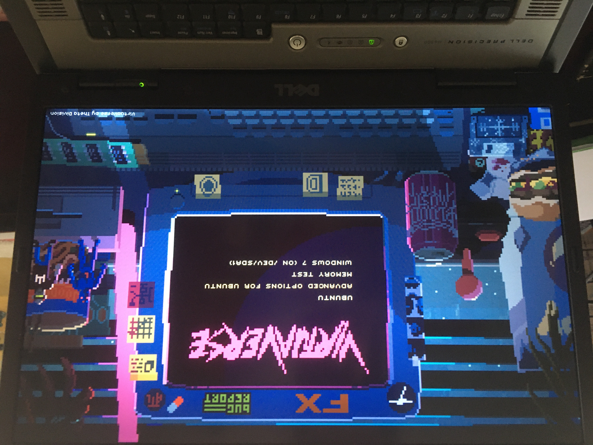

This directory clones from [Patato777/dotfiles](https://github.com/Patato777/dotfiles.git)



If you want to set grub's theme like this above image, you can run Patato777's script

```bash
./scripts/setup_grub_theme.sh
```


